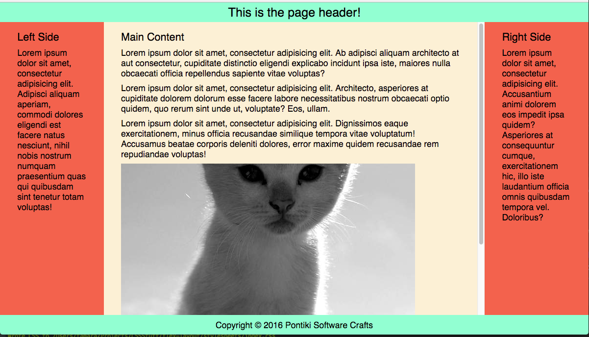
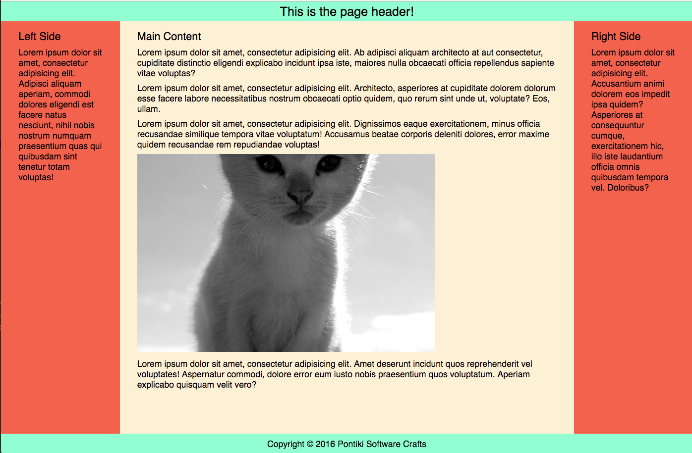

# sample flex website layout

A sample using flex to get a standard website:

```

+------------------------------------------------------------------+
|                                                                  |
|                          header                                  |
|                                                                  |
+------------------------------------------------------------------+
|           |                                           |          |
|           |                                           |          |
|           |                                           |          |
|   left    |                main                       |  right   |
|           |                                           |          |
|           |                                           |          |
|  sidebar  |               content                     |  content |
|           |                                           |          |
|           |                                           |          |
|           |                                           |          |
|           |                                           |          |
|           |                                           |          |
|           |                                           |          |
|           |                                           |          |
|           |                                           |          |
|           |                                           |          |
+------------------------------------------------------------------+
|                                                                  |
|                          footer                                  |
|                                                                  |
+------------------------------------------------------------------+
```

with full height columns

Following ideas on 

* [A Complete Guide to Flexbox  CSS-Tricks](https://css-tricks.com/snippets/css/a-guide-to-flexbox/)
* [Fluid Width Equal HeightColumns  CSS-Tricks](https://css-tricks.com/fluid-width-equal-height-columns/)
* [Full-Height Flexbox Columns](http://codepen.io/Ushinro/pen/rVBwEo?editors=1100)
* [Demo Flexbox 3](http://codepen.io/team/css-tricks/pen/jqzNZq)
* [Flexbox Method](http://codepen.io/chriscoyier/pen/raGKwM)


## Screenshots

### small window size, showing overflow scroll



### larger window size, no scroll


